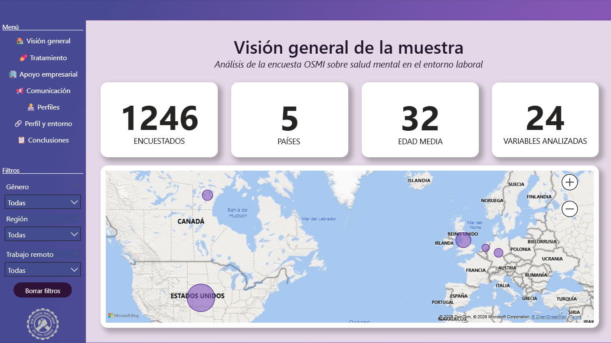
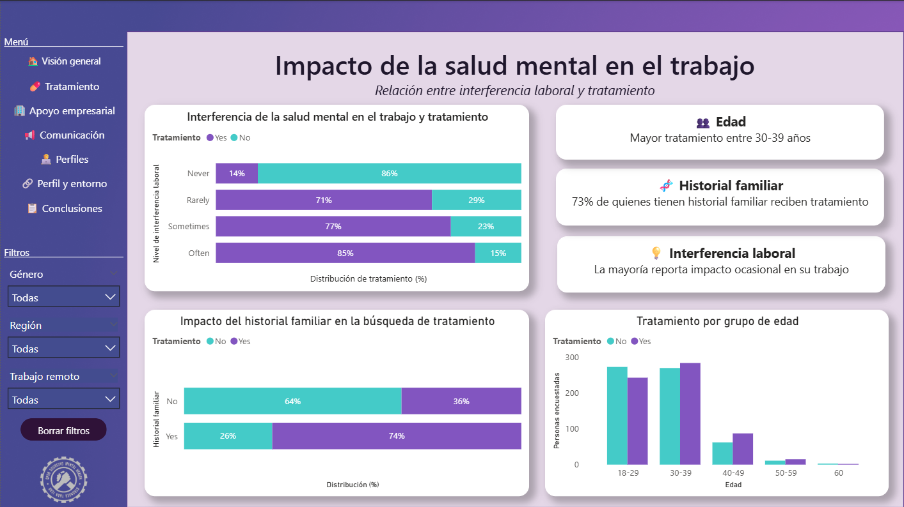
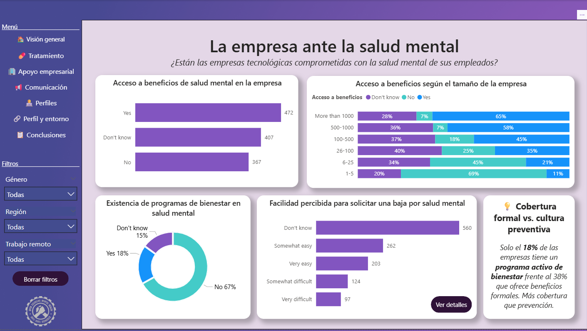
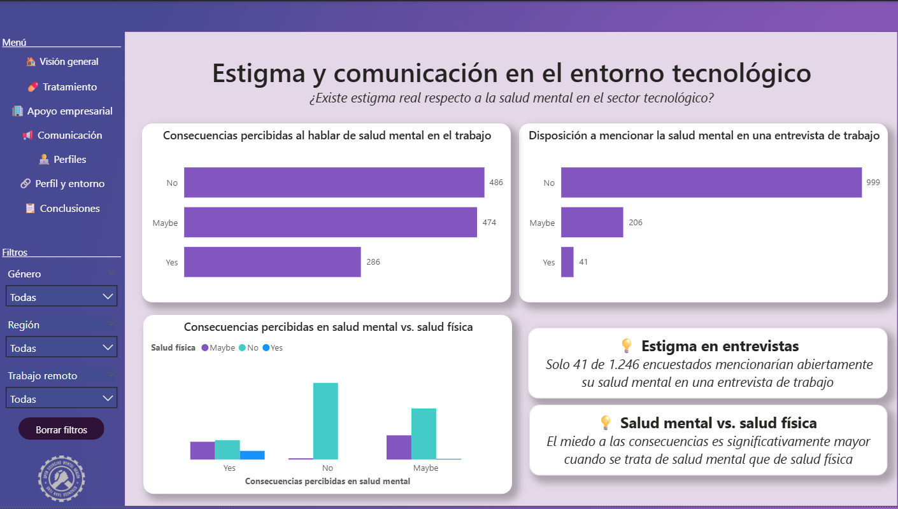
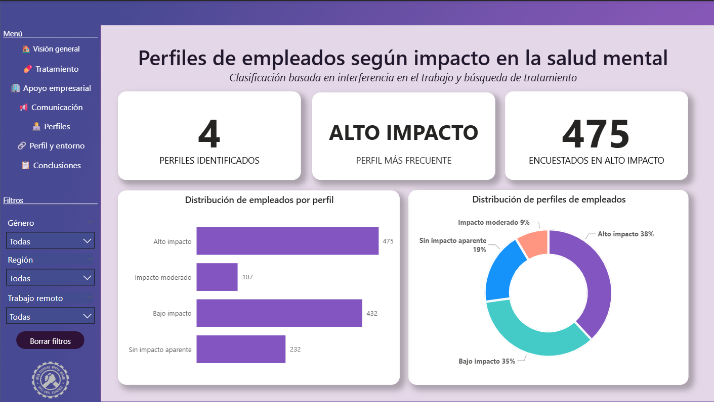
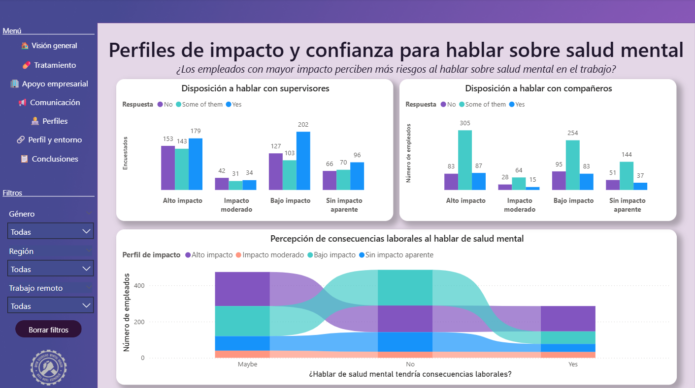
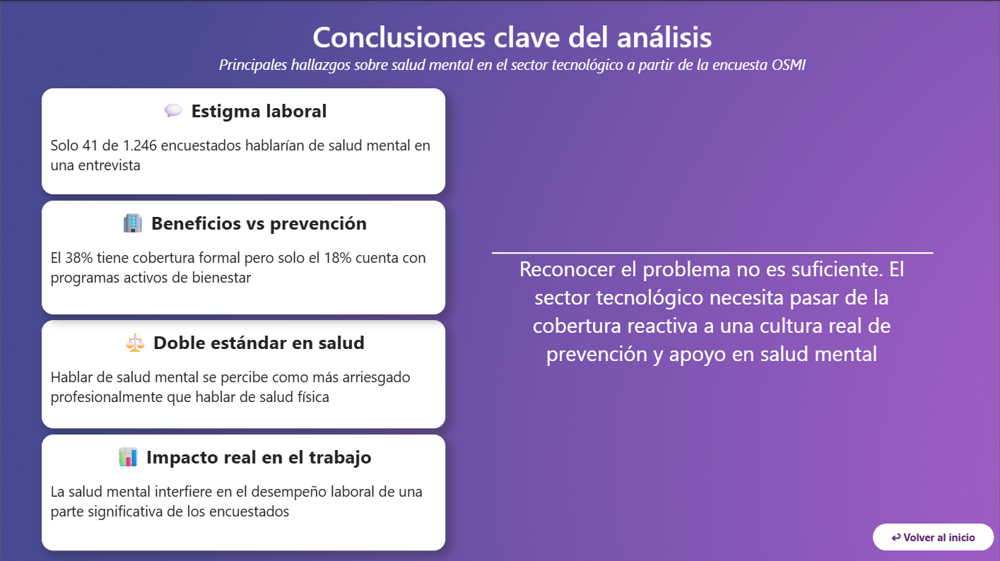

# Mental Health in Tech — Análisis del impacto de la salud mental en el entorno laboral

    

---

**📌 Mi contribución en este proyecto**  
Me encargué del EDA y limpieza del dataset en Python (`notebooks/01_eda_limpieza_osmi.ipynb`) y del diseño y desarrollo de los dashboards de Power BI: Impacto de la salud mental en el trabajo, Perfiles de empleados según impacto e Impacto y entorno laboral y los insights del dashboard de Conclusiones.

---
Proyecto académico desarrollado en el **Bootcamp de Data Analyst & IA de Adalab**.

Este proyecto analiza la relación entre la **salud mental y el entorno laboral en el sector tecnológico**, utilizando datos de la encuesta **OSMI Mental Health in Tech Survey**.  

El objetivo es explorar patrones, identificar factores que influyen en el bienestar de los empleados y visualizar los resultados mediante **dashboards interactivos en Power BI**.

---

## Autoras

**Nieves Sánchez**  

[](https://github.com/nieves-sanchez)
[](https://www.linkedin.com/in/nieves-sanchez-data)

**Ana María Castro**  

[](https://github.com/Narciandi90)
[](https://www.linkedin.com/in/ana-maria-castro-narciandi/)

---

## Objetivo del proyecto

El objetivo principal del proyecto es analizar cómo diferentes factores laborales influyen en la salud mental de los profesionales del sector tecnológico.

A través del análisis exploratorio de datos y la visualización interactiva se busca:

- Explorar la relación entre salud mental y entorno laboral
- Analizar el impacto del apoyo empresarial y los beneficios disponibles
- Identificar perfiles de empleados con mayor vulnerabilidad
- Facilitar la interpretación de los datos mediante dashboards interactivos

---

## Dataset

El dataset utilizado proviene de la encuesta **Mental Health in Tech Survey** realizada por **Open Sourcing Mental Illness (OSMI)**.

La encuesta recoge información sobre:

- situación laboral
- tamaño de la empresa
- beneficios de salud mental
- cultura organizacional
- actitudes hacia la salud mental en el trabajo
- experiencias personales relacionadas con la salud mental

Fuente de datos:

OSMI Mental Health in Tech Survey

---

## Tecnologías utilizadas

Este proyecto combina herramientas de análisis de datos y visualización:

- Python
- Pandas
- Jupyter Notebook
- Power BI
- Git
- GitHub

---

## Estructura del repositorio

```text
data
│
├── raw
│   └── survey.csv
│
└── processed
    └── osmi_mental_health_clean.csv

notebooks
│
└── 01_eda_limpieza_osmi.ipynb

dashboards
│
└── osmi_mental_health_dashboard.pbix

assets
│
├── portada.png
├── vision_general.png
├── impacto_laboral.png
├── apoyo_empresarial.png
├── estigma.png
├── perfiles_empleados.png
├── perfiles_y_entorno.png
└── conclusiones.png

README.md
```

Descripción de carpetas:

**data/raw**  
Contiene el dataset original sin modificar.

**data/processed**  
Incluye el dataset limpio y preparado para su uso en el dashboard.

**notebooks**  
Notebook con el análisis exploratorio de datos (EDA) y el proceso de limpieza.

**dashboards**  
Archivo de Power BI con las visualizaciones finales del proyecto.

**assets**
Carpeta que contiene las capturas de los dashboards utilizadas en este README para mostrar una vista previa visual del proyecto.

---

## Análisis exploratorio de datos

En el notebook se realiza un proceso de **EDA (Exploratory Data Analysis)** para comprender la estructura del dataset y preparar los datos para la visualización.

Las principales etapas incluyen:

- revisión de estructura del dataset
- análisis de tipos de variables
- detección de valores nulos
- identificación de duplicados
- limpieza y transformación de variables
- generación de un dataset final limpio para Power BI

---

## Dashboards en Power BI

El proyecto se presenta mediante una serie de **dashboards interactivos desarrollados en Power BI**, diseñados para explorar la relación entre salud mental y entorno laboral en el sector tecnológico a partir de la encuesta **OSMI Mental Health in Tech Survey**.

Los dashboards permiten analizar el problema desde distintas perspectivas: características de la muestra, impacto laboral, políticas empresariales, estigma en el entorno de trabajo y perfiles de empleados según su nivel de impacto.

---

### Portada


Pantalla de introducción al proyecto que presenta el objetivo del análisis, el contexto del estudio y las herramientas utilizadas.

---

### Visión general de la muestra



Este dashboard ofrece una **visión global del dataset y del perfil general de los encuestados**.

Incluye indicadores clave como:

- número total de participantes en la encuesta  
- edad media de los encuestados  
- número de países representados  
- número de variables analizadas  

Además, incorpora un **mapa geográfico** que permite visualizar la distribución de la muestra por países y filtros interactivos para explorar los datos según género, región, trabajo remoto y perfil de empleado.

---

### Impacto de la salud mental en el trabajo



Este dashboard analiza cómo la salud mental **interfiere en el desempeño laboral y cómo se relaciona con la búsqueda de tratamiento**.

Entre los aspectos analizados destacan:

- relación entre interferencia en el trabajo y tratamiento recibido  
- impacto del historial familiar de salud mental  
- distribución del tratamiento según grupos de edad  

---

### La empresa ante la salud mental



Este dashboard examina **el papel de las empresas tecnológicas en el apoyo a la salud mental de sus empleados**.

El análisis incluye:

- acceso a beneficios de salud mental  
- diferencias según tamaño de empresa  
- existencia de programas de bienestar  
- facilidad percibida para solicitar bajas por salud mental  

---

### Estigma y comunicación en el entorno tecnológico



Este dashboard explora **el estigma asociado a la salud mental en el entorno laboral**.

Se analizan variables como:

- consecuencias percibidas al hablar de salud mental  
- disposición a mencionarlo en entrevistas laborales  
- comparación entre percepciones sobre salud mental y salud física  

---

### Perfiles de empleados según impacto



En este dashboard se realiza una **segmentación de empleados según el impacto de la salud mental en su trabajo**.

Se identifican cuatro perfiles:

- alto impacto  
- impacto moderado  
- bajo impacto  
- sin impacto aparente  

---

### Impacto y entorno laboral



Este dashboard analiza **cómo los diferentes perfiles de impacto se relacionan con la confianza para hablar sobre salud mental en el trabajo**.

Incluye análisis sobre:

- comunicación con supervisores  
- comunicación con compañeros  
- percepción de consecuencias laborales  

---

### Conclusiones del análisis



Dashboard final que resume los **principales hallazgos del análisis**, destacando los aspectos más relevantes identificados en el estudio.
---

## Contexto académico

Este proyecto forma parte del **Bootcamp de Data Analyst & IA de Adalab**, donde se aplican conocimientos de:

- análisis de datos
- limpieza y preparación de datasets
- visualización de información
- comunicación de insights mediante dashboards

El objetivo del proyecto es aplicar metodologías de análisis de datos en un caso práctico y desarrollar habilidades técnicas y analíticas propias del rol de **Data Analyst**.

---

## Licencia

Este proyecto se desarrolla con fines educativos como parte del bootcamp de Adalab.
